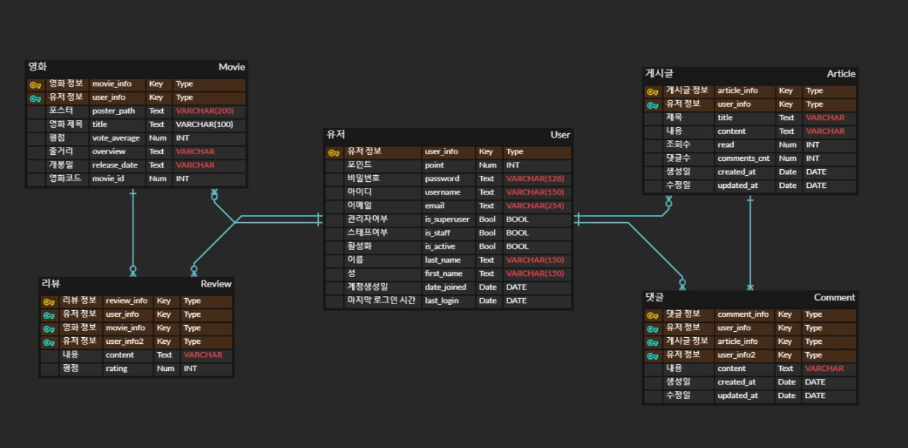
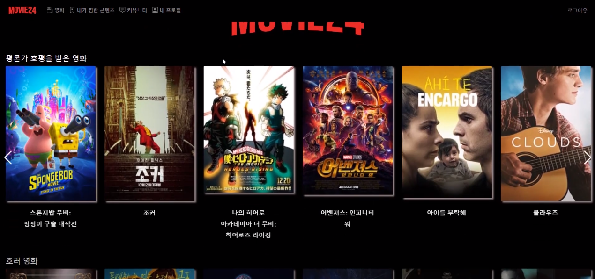
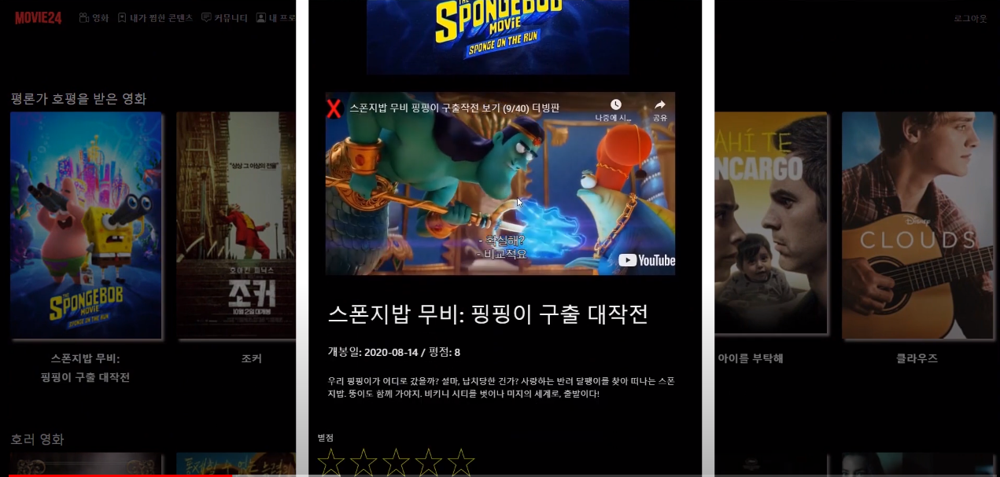
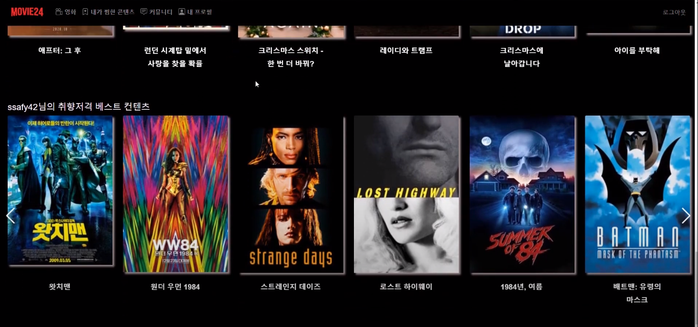
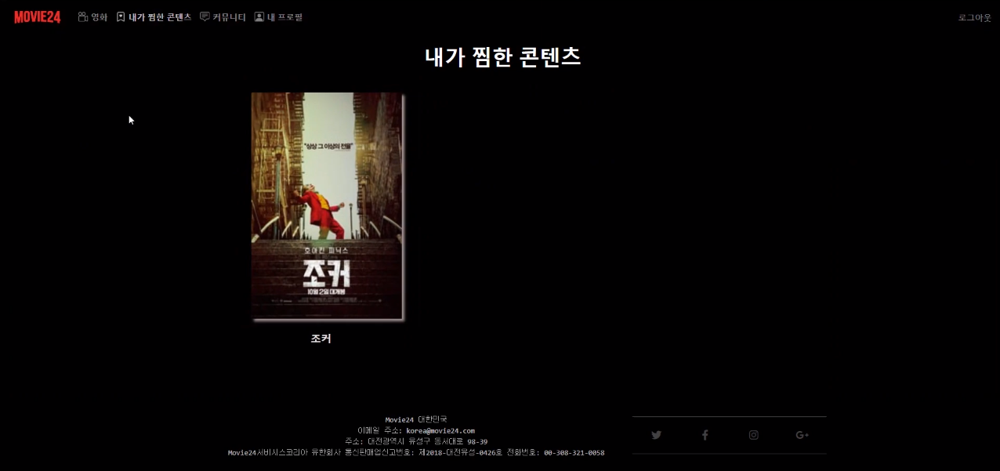
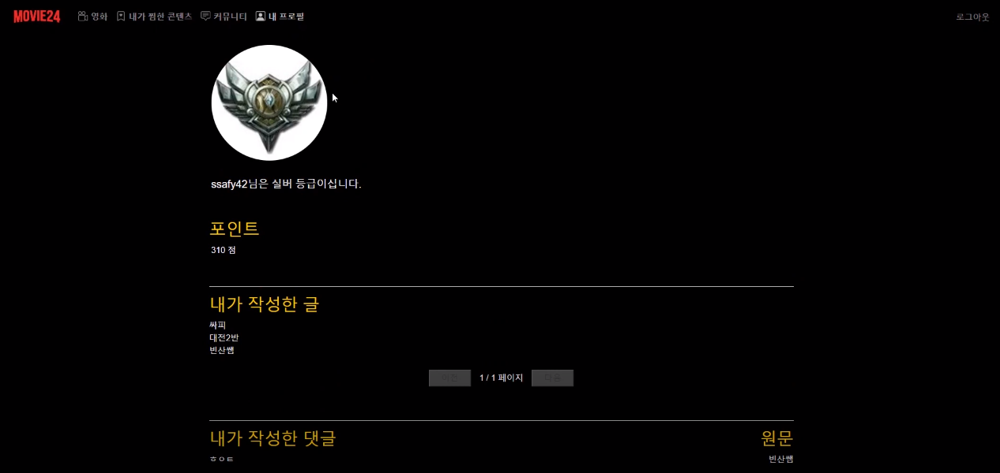
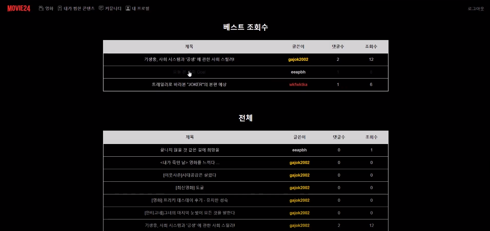

[TOC]

# :movie_camera: Movie24

> 영화 정보 커뮤니티 'Movie24'
>
> - 기술스택: **Django REST API 서버** & **Vue2**
> - 개발기간: 2주

:tv: **UCC** - [링크](https://www.youtube.com/watch?v=9LAXmbI4Jlo)

## 1. 팀원

- **박봉현** - frontend
- **이동훈** - frontend
- **정현우** - backend

## 2. 서비스 구현

> 별점 기반 영화 추천 서비스 제공 
>
> 평론가 / 장르별 / 상영중 영화 추천 서비스 제공
>
> 영화 토론 커뮤니티 구현
>
> 유저 등급 기능 구현 

## 3. 데이터베이스 모델링(ERD)

## 4. 화면

|                           **메인**                           |                       세부정보 & 리뷰                        |
| :----------------------------------------------------------: | :----------------------------------------------------------: |
|  |  |
|                  **별점 기반 추천 서비스**                   |                     **내가 찜한 컨텐츠**                     |
|  |  |
|                          **프로필**                          |                         **커뮤니티**                         |
|  |  |

## 5. 필수 기능에 대한 설명

- **관리자 뷰 (django-admin)** 

  - 관리자 권한의 유저만 영화 등록 / 수정 / 삭제 권한을 가집니다.
  - 관리자 권한의 유저만 유저 관리 권한을 가집니다.

  

- **영화 정보**

  - TMDB Api를 통해 데이터를 수집하고 저장하였습니다.
  - 로그인 된 유저가 영화에 대한 별점, 리뷰 등록 / 수정 / 삭제 가능
  - 영화 상세 페이지에서 포스터, 개봉일, 줄거리 등을 확인 할 수 있습니다. 
  - 영화 전체 목록에서 제목 검색 기능 구현

  

- **추천 알고리즘**

  - 별점 기반 영화 추천 기능

    - 유저는 영화 상세 정보 페이지에서 영화의 별점을 매길 수 있습니다.
  - 만약 별점을 7점 이상 준다면, 유저가 선호하는 영화로 인식됩니다.
  - 유저가 선호하는 영화를 바탕으로, 홈 화면에서 비슷한 유형의 영화 리스트를 보여줍니다.
  
    - API 요청: `https://api.themoviedb.org/3/movie/${movieId}/similar`
  
  - 평론가 평점 / 장르별 / 상영중 영화 추천 기능
  
  
  
- **커뮤니티**

  - 로그인한 사용자만 글 조회 / 생성 가능
  - 작성자 본인만 글 수정 / 삭제 가능
  - 로그인한 사용자만 댓글 조회 / 생성 가능
  - 페이지네이션을 적용하여 한 번에 10개이 게시글이 먼저 보이도록 설정
  - 댓글수와 조회수를 표시
    - 조회수를 기반으로 베스트 게시글 3개를 상단에서 먼저 보여줌
  - 검색 기능(제목, 아이디)을 추가하여, 해당 문자열이 있는 게시글 목록이 보이도록 설정

- **기타 추가 기능**
  - 영화 상세 정보 페이지에서 유튜브 리뷰영상 자동재생 구현
  - 유저 랭크 기능 구현
    - 게시글을 달면 +100P, 댓글을 달면 +10P
    - 이렇게 획득한 Point를 기준으로 등급을 나눔 (브론즈, 실버, 골드)
  - 별점 기능 구현
    - 별 반개 당 1점씩 하여 총 10점 만점 구현
    - 실제 프론트에서 별을 클릭하도록 구현
  - 웹페이지 디자인

